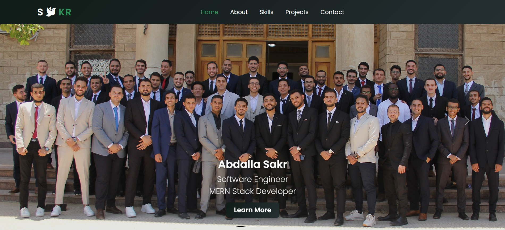

# Abdalla Sakr – Portfolio Website

Welcome to my personal portfolio website! This site showcases my web development projects, my technical and soft skills,    
and how to contact me for collaboration or freelance opportunities.

## 🔗 Live Demo
[Click here for live demo](https://abdallaskar.github.io/Sakr_portfolio/)

---
## Screan Shoot 

---

## 📌 Sections Overview

### 🏠 Home
An elegant and responsive landing section introducing me as a web developer. It features smooth scrolling, modern fonts, and animation.

### 👨‍💻 About Me
A brief introduction about who I am, my background, and what drives me in the field of web development.

### 🧠 Skills
A dynamic section highlighting both technical and soft skills using icons, animations, and hover effects.

- **Technical Skills**: HTML, CSS, JavaScript, Bootstrap, React, Node.js, MongoDB, Git, GitHub.
- **Soft Skills**: Communication, Teamwork, Time Management, Problem Solving.

### 📂 Projects
Below is a summary of the projects I’ve included in the Projects section of the portfolio:

#### 🚗 1. **Easy Drive – Car Rental App**
- **Type**: Web Application
- **Tech Stack**: HTML, CSS, JavaScript, Bootstrap
- **Description**: A responsive car rental website where users can browse available cars, select rental options,
   and submit rental requests.
- **Features**:
  - Car listings with images and details
  - Responsive and mobile-friendly layout
  - Booking form for rental

#### 🌤️ 2. **Easy Weather App**
- **Tech Stack**: HTML, CSS, JavaScript, OpenWeatherMap API
- **Description**: A simple weather application that fetches real-time data for any city.
- **Features**: Temperature, humidity, wind speed, icon display.

#### 👤 3. **Sakr Profile Page**
- **Tech Stack**: HTML, CSS, Bootstrap
- **Description**: A responsive personal profile landing page with links to social media and GitHub.

#### ✅ 4. **Todo Organizer App**
- **Tech Stack**: HTML, CSS, JavaScript (Local Storage)
- **Description**: A task management web app with support for adding, removing, filtering tasks.
- **Features**: Dark mode, persistence using localStorage.

#### 🧾 5. **E-Receipt (Arabic Tax Invoice)**
- **Tech Stack**: HTML, CSS (Bootstrap 5 RTL), JavaScript
- **Description**: A responsive Arabic RTL invoice template for digital receipts and invoices.
- **Features**: Supports item input, totals, and Arabic labels.

### 📞 Contact Me
You can reach out to me for any collaboration or project opportunities 

---

## 🛠 Tech Stack Used in Portfolio
- HTML5
- CSS3 + Bootstrap 5
- JavaScript
- Git & GitHub
- Responsive Web Design
- CSS Animations

---

## 🙋‍♂️ Author

**Abdalla Sakr**  
Software Developer | MERN Stack Trainee | Freelancer  
